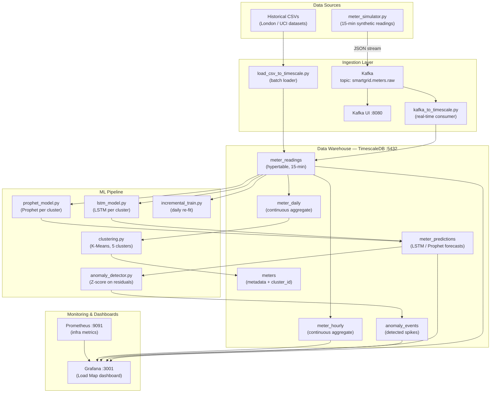
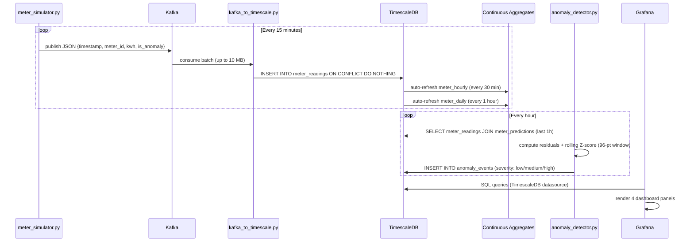
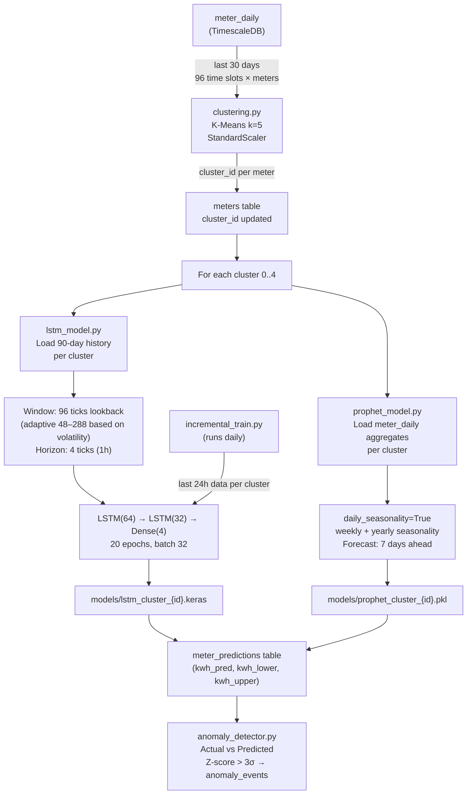
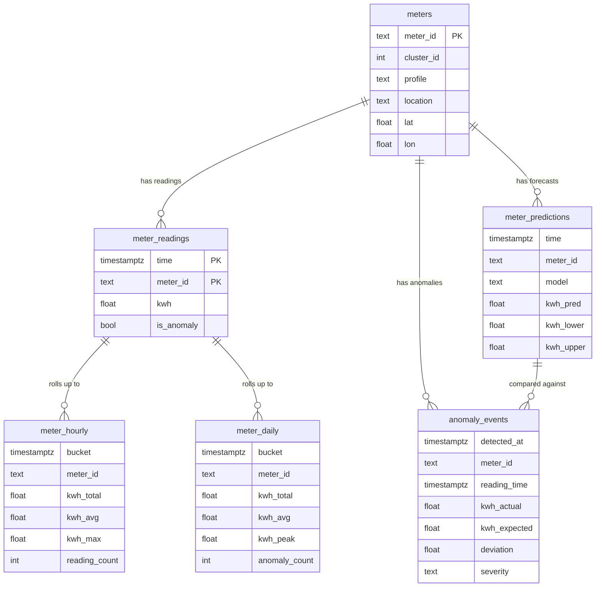
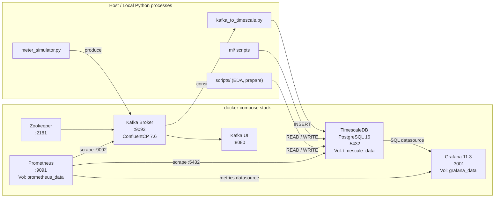
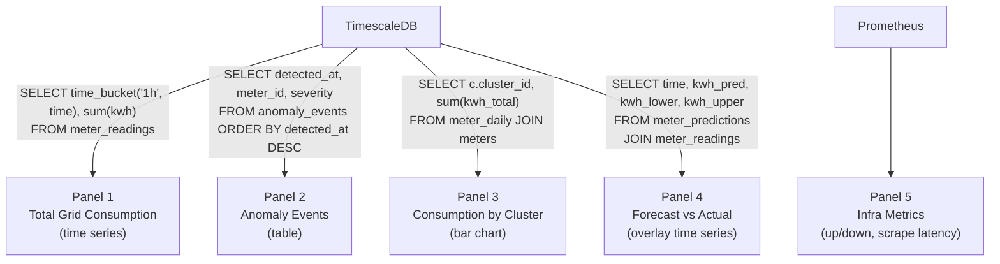
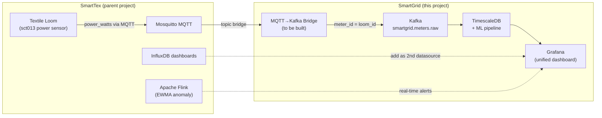

# SmartGrid — Architecture

## 1. High-Level System Overview

---

## 2. Real-Time Data Flow

---

## 3. ML Training Pipeline

---

## 4. Database Schema

---

## 5. Infrastructure & Container Topology

---

## 6. Grafana Dashboard Panels

---

## 7. SmartTex Integration Path

---

## Link to SmartTex (parent project)

| SmartTex | SmartGrid | Integration path |
|---|---|---|
| `sct013_power` → kW per loom | kWh per smart meter | Add MQTT→Kafka bridge; looms become meters |
| Flink EWMA anomaly | LSTM/Prophet anomaly | Complementary: Flink for real-time, ML for forecasting |
| InfluxDB dashboards | TimescaleDB dashboards | Can be added as separate Grafana datasource |
| Mosquitto MQTT broker | Kafka | MQTT source connector or custom bridge script |

When merging: SmartTex machines expose `power_watts` → bridge to Kafka topic → same pipeline.
