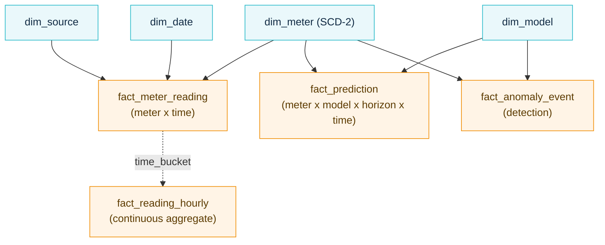
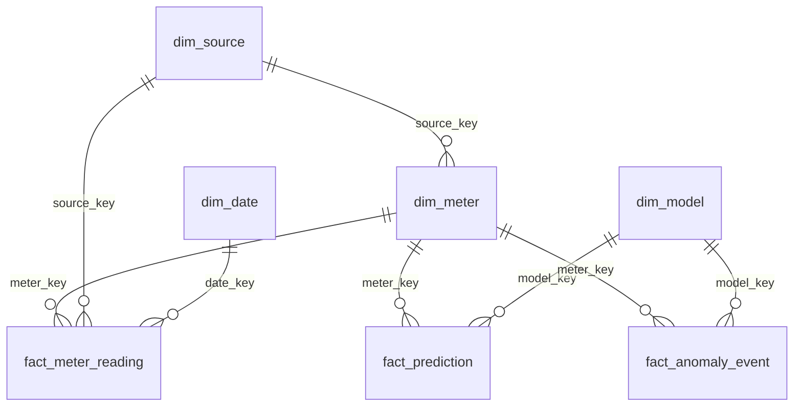
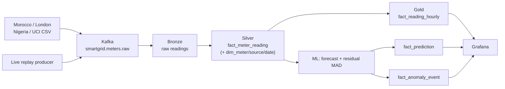
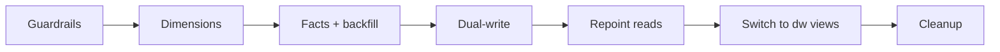

# SmartGrid Data Warehouse Architecture

The warehouse schema is defined in `warehouse/schema_v2.sql`; the progressive,
zero-downtime rollout is described in `docs/migration_plan_dw_v2.md`. Mermaid
sources live in `docs/diagrams/dw_*.mmd` and rendered PNGs in
`reports/dw_design/media/`.

---

## 1. Model — star / galaxy with conformed dimensions

A **star / fact-constellation (galaxy)** on a time-series engine (TimescaleDB):
three fact tables share four conformed dimensions. It is **not** a snowflake — no
normalized dimension hierarchies — which keeps joins low for read-heavy dashboards
and ML feature pulls.

### Dimensions (`dw`)
| Dimension | Notes |
|---|---|
| `dim_meter` (**SCD-2**) | surrogate `meter_key`, natural `meter_id`, profile, feeder/disco, lat/lon, `valid_from/valid_to/is_current` |
| `dim_source` | dataset origin, country, region, utility/disco |
| `dim_date` | calendar: weekday, month, season, holiday flag, tariff period |
| `dim_model` | model name, version, family, hyperparameters, training run id |

### Facts (`dw`, time-partitioned hypertables, FK → dimensions)
| Fact | Grain |
|---|---|
| `fact_meter_reading` | meter × timestamp — `kwh`, `is_anomaly` |
| `fact_prediction` | meter × model × horizon × timestamp — `kwh_pred`, `kwh_lower`, `kwh_upper` |
| `fact_anomaly_event` | one detection — `kwh_actual`, `kwh_expected`, `deviation`, `severity`, `anomaly_type` |

### Entity-relationship (keys)

### Physical layer (TimescaleDB)
- Hypertables on every fact (`time` partition, 7-day chunks).
- **Continuous aggregates** (15 m / hourly / daily) over `fact_meter_reading`.
- **Native compression** on chunks older than ~7 days; **retention** policy on raw facts.
- Unique constraints + indexes on `(meter_key, time)` / `(meter_key, model_key, time)`.

---

## 2. Medallion data flow

Bronze (raw) → silver (clean/typed facts + dimensions) → gold (aggregates + marts)
separates ingestion, normalization, and serving.

---

## 3. Star vs Snowflake — decision

**Star (chosen).** Smart-grid dimensions are low-cardinality and the workload is
read-heavy (Grafana dashboards + ML feature pulls). Denormalized dimensions mean
fewer joins and faster reads.

**Snowflake (rejected).** Normalizing dimensions into hierarchies
(`meter → location → city → region`) only pays off for very large/redundant
dimensions or strict-normalization governance — neither applies here. It would add
join cost for negligible storage savings.

---

## 4. Progressive rollout (zero downtime)

The model is built in the dedicated `dw` schema; early phases are purely additive,
reads switch only once parity is verified, and consumers are preserved through
identical-column compatibility views. See `docs/migration_plan_dw_v2.md`.

